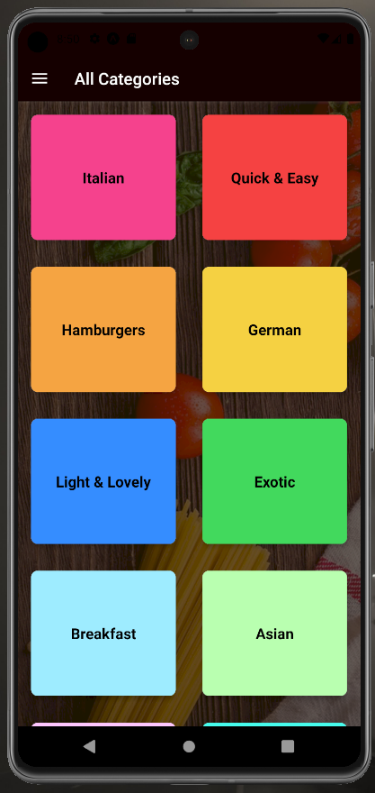

# React-Native Meal Planner App
Meal app in which users can explore meals, read cooking instructions, add/remove meals from their Favorites List, and review favorites. Practiced navigation with nested routing (Drawer and Stack) as well as app-wide state management with Context API. 

## Install Locally & View on Your Mobile Device

1. Download "Expo Go" App to your mobile device
2. Clone the repo with `git clone [url]`
2. `cd` into the project directory
3. Run `npm install` to install dependencies
4. Run `npm start` to start server
5. Scan the resulting QR code with your mobile device's camera; app will open through Expo Go
    * Note: Local machine and mobile device must be connected to the same network (public networks are fussy)

## Technology Stack
* Native framework: React Native / Expo

## Future Development
* Implement Redux to practice alternate methods of state-wide management

## Screenshots

---

---

---

---

---

